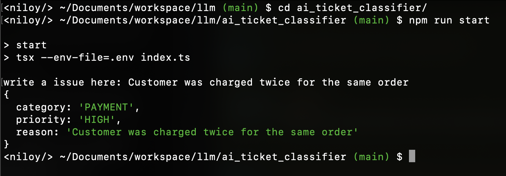

A collection of small to medium AI engineering projects built while learning practical AI/LLM engineering.

## Projects

# AI Ticket Classifier



<details>
<summary><b>Project Details</b></summary>
<br>

**What it does**  
A Node.js command-line tool that uses the Gemini API to automatically categorize and prioritize customer support tickets, providing a structured JSON response.

**Key concepts/technologies**

- TypeScript / Node.js
- `@google/genai` SDK
- Structured JSON Output (JSON Schema)
- System Instructions / Prompt Engineering
- **Resilience & Reliability:** Retries with Exponential Backoff, Request Timeouts, Model Fallback
- **Runtime Validation:** Zod Schema validation for reliable output parsing

**Examples**

**Input:** `I was charged twice for the same order.`
**Output:**

```json
{
  "category": "PAYMENT",
  "priority": "HIGH",
  "reason": "Customer was charged twice for the same order."
}
```

**Input:** `I forgot my password and cannot log into my account.`
**Output:**

```json
{
  "category": "ACCOUNT",
  "priority": "MEDIUM",
  "reason": "User cannot log into their account due to a forgotten password."
}
```

**Input:** `The app crashes every time I try to upload a profile picture.`
**Output:**

```json
{
  "category": "TECHNICAL",
  "priority": "MEDIUM",
  "reason": "The app crashes every time the user tries to upload a profile picture, indicating a software defect."
}
```

**Input:** `My order was supposed to arrive yesterday, but I still haven't received it.`
**Output:**

```json
{
  "category": "SHIPPING",
  "priority": "MEDIUM",
  "reason": "Order was supposed to arrive yesterday but hasn't been received."
}
```

**Input:** `I returned the product 7 days ago, but I haven't received my refund yet.`
**Output:**

```json
{
  "category": "REFUND",
  "priority": "MEDIUM",
  "reason": "Customer has not received a refund 7 days after returning the product."
}
```

</details>

# AI Customer Support Assistant

<details>
<summary><b>Project Details</b></summary>
<br>

**What it does**  
A full-stack web application that provides AI-driven customer support. It integrates a NestJS backend with a Next.js frontend, using the Gemini API to assist customers with queries about their orders, products, and general support issues based on conversation history and structured data.

🌟 **Highlight: Intelligent Context Management**  
Instead of naively passing the entire chat history to the LLM—which rapidly consumes token limits—this project implements a **rolling AI summary pattern**.

- Uses Gemini's structured output to dynamically generate and update a running summary of the conversation.
- Persists the summary in PostgreSQL and injects it into the context of subsequent prompts.
- **Result:** Drastically reduced token usage, virtually infinite conversational memory, and preserved core context without history bloat!

**Key concepts/technologies**

- **Frontend:** Next.js, React, Tailwind CSS
- **Backend:** NestJS, TypeScript, Prisma ORM, PostgreSQL
- **AI Integration:** `@google/genai` SDK
- **Database Schema:** Real-world modeling of Customers, Orders, Products, and Conversations

</details>
